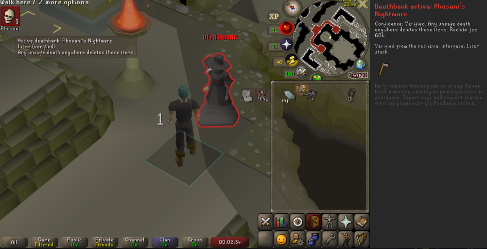

# Deathbank Utility

RuneLite plugin that tracks OSRS item retrieval services (deathbanks — Zulrah, Vorkath,
Nex, ToB, ToA, Hydra, and friends) and gets loud before you lose what's inside.



Items in a retrieval service are deleted on **any unsafe death anywhere** — a fact the
game only mentions in an easily-missed login message. This plugin:

- shows a **red indicator** while a deathbank is active, labelled with where it is
  (ToB, Phosani, Zulrah, ...) and carrying an honest confidence tier: *verified*
  (white) / *inferred* (yellow) / *unknown* (orange), with the details on hover
- **highlights the claim point**, outlining the chest or NPC holding your items and
  labelling it DEATHBANK
- **remembers what went in** — estimated from your pre-death inventory, upgraded to
  exact contents whenever you open the retrieval interface
- **reconciles at login**: if the game's retrieval warning is enabled and doesn't
  appear, a stale saved deathbank is cleared instead of lying forever
- **warns on damage taken** while a bank is active (configurable screen flash, sound,
  and client focus request), staying quiet in safe content (NMZ, CoX, LMS, ...)
- notifies when a second unsafe death **wipes** the bank

Unlike prior art, inferences are never presented as facts — every state carries how
the plugin learned it.

## How this differs from Dude, Where's My Stuff?

[Dude, Where's My Stuff?](https://github.com/Thource/dude-wheres-my-stuff) pioneered
deathbank tracking, and studying why its death storage is unreliable shaped this
plugin's design. Its contents come from a post-death inventory snapshot minus
kept-items heuristics, so any estimation error is displayed as fact. Emptying a bank
is only detected through a handful of specific hooks, so claiming your items on
mobile, on another client, or with the plugin off leaves a phantom "active" bank
forever. And its hardcoded respawn-region tables silently drop deaths they don't
recognize.

This plugin makes different choices:

- **Inference is labeled as inference.** Every state carries how it was learned:
  verified by a server signal, inferred from a death, or unknown. Item lists are
  marked estimated until the retrieval interface confirms them.
- **The login message is used as ground truth in both directions.** The game tells
  you at login when a retrieval service holds items. If that warning is enabled and
  does not appear, a saved bank is cleared instead of trusted forever. This closes
  the phantom-bank loophole entirely, every login is a fresh sync point.
- **Unrecognized situations degrade loudly, not silently.** An unknown retrieval
  window still tracks as a bank with its window title as the label, rather than
  being dropped because a lookup table is stale.

## Early release

This plugin is an early release and not feature complete. Deathbank state is inferred
from game signals and can be wrong in both directions. Never treat a missing warning
as proof you have no deathbank, especially on an ultimate ironman. Bug
reports and feature requests are very welcome on the
[issues page](https://github.com/jakevollkommer/deathbank-utility/issues), also
reachable from the plugin config's Feedback section.

Roadmap: optional blocking of dangerous content while a bank is active, and reclaim
fees in the side panel. Testing criteria for dev-client sign-off live in
[TESTING.md](TESTING.md).

## Development

```
./gradlew runPlugin   # launches RuneLite in developer mode with the plugin loaded
./gradlew jar         # builds the sideloadable jar
```
